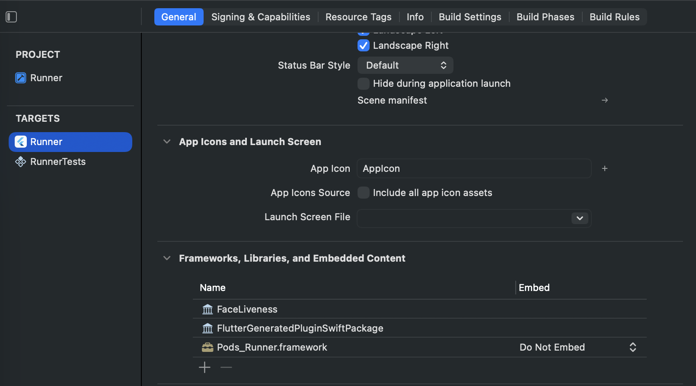

# aws_liveliness

A Flutter plugin that wraps [AWS Amplify's Face Liveness detection](https://docs.amplify.aws/) 
(built on Amazon Rekognition) for Android and iOS, giving you a single Dart API
to launch a native liveness check and get a pass/fail result back.

|             | Android | iOS |
|-------------|:-------:|:---:|
| Support     |   ✅    | ✅  |
| Min version | API 24  | iOS 14 |

> ⚠️ This plugin only handles the **client-side detection UI**. Creating a
> liveness session (`CreateFaceLivenessSession`) must happen on **your
> backend**, using the AWS SDK with your AWS credentials — never embed AWS
> credentials capable of creating sessions inside your app. See
> [Backend requirement](#backend-requirement) below.

## Features

- Launches the native AWS Amplify Face Liveness detection flow (camera-based
  challenge/response check) on both platforms.
- Handles camera permission requests on Android automatically.
- Safely configures Amplify if your app hasn't already — won't crash or
  double-configure if you use Amplify for other things too.
- Supports both Swift Package Manager and CocoaPods on iOS.

## Installation

```yaml
dependencies:
  aws_liveliness: ^0.0.1
```

```bash
flutter pub get
```

## Setup

### Backend requirement

Before calling this plugin, your app needs a `sessionId`. That comes from
your own backend calling Amazon Rekognition's `CreateFaceLivenessSession`
API with your AWS credentials (Cognito Identity Pool / IAM role scoped for
liveness). This plugin does **not** create sessions — it only runs the
client-side detection UI against a session you already have.

A minimal flow looks like:

1. Your app requests a new liveness session from your backend.
2. Your backend calls `CreateFaceLivenessSession` and returns the `sessionId`.
3. Your app calls `AwsLiveliness().startLivenessCheck(sessionId: ..., region: ...)`.
4. Your backend calls `GetFaceLivenessSessionResults` to retrieve the
   confidence score and reference image — the device itself never sees the
   final liveness score.

### Android

1. **Add the Amplify configuration file to your project:**

   Place `amplifyconfiguration.json` in `android/app/src/main/res/raw/`.
   (Create the `raw` folder if it doesn't exist.) See
   [sample config](#sample-amplifyconfigurationjson) below.

2. **Add the camera permission** if it's not already present (the plugin
   declares it for you via manifest merging, but it's good to be explicit
   if your app also uses the camera elsewhere):

   ```xml
   <uses-permission android:name="android.permission.CAMERA"/>
   ```

3. **Add the required plugins** to `android/settings.gradle.kts`:

   ```kotlin
   plugins {
       id("dev.flutter.flutter-plugin-loader") version "1.0.0"
       id("com.android.application") version "8.9.1" apply false
       id("org.jetbrains.kotlin.android") version "2.3.20" apply false
       id("org.jetbrains.kotlin.plugin.compose") version "2.3.20" apply false
   }
   ```

4. **Add the required dependencies** to `android/app/build.gradle.kts`
   (or `build.gradle` if you're not on Kotlin DSL):

   ```kotlin
   dependencies {
       implementation("com.amplifyframework.ui:liveness:1.4.0")
       implementation("com.amplifyframework:aws-auth-cognito:2.29.0")
       implementation("com.amplifyframework:aws-predictions:2.29.0")
       implementation("androidx.activity:activity-compose:1.9.3")
       implementation(platform("androidx.compose:compose-bom:2024.10.00"))
       implementation("androidx.compose.material3:material3")
       implementation("androidx.appcompat:appcompat:1.7.0")
       coreLibraryDesugaring("com.android.tools:desugar_jdk_libs:2.1.5")
   }
   ```

5. **Enable Compose compiler** in `android/app/build.gradle.kts` by adding the plugin:

   ```kotlin
   plugins {
       id("org.jetbrains.kotlin.plugin.compose")
   }
   ```

6. **Set `minSdkVersion` to 24** in `android/app/build.gradle`:

   ```gradle
   android {
       defaultConfig {
           minSdkVersion 24
       }
   }
   ```

No further native setup is required — the plugin's own manifest merges the
`LivenessActivity` declaration into your app automatically.

### iOS

1. **Add the Amplify configuration files to your project:**

   Place `amplifyconfiguration.json` and `awsconfiguration.json` in the
   `ios` directory, then **open the project in Xcode and manually add both
   files** (drag them into the `Runner` group, making sure "Copy items if
   needed" and the `Runner` target are checked). Xcode won't pick them up
   automatically just by having them in the folder — they need to be added
   to the project/target explicitly, or they won't be bundled into the app.

2. **Add the Amplify UI Swift Liveness package:**

   In Xcode: `File > Add Packages...`, then paste this URL into the search
   bar and hit Enter:

   ```
   https://github.com/aws-amplify/amplify-ui-swift-liveness
   ```

   Wait for the package to resolve, then add it to the `Runner` target.

3. **Confirm it's linked under Frameworks, Libraries, and Embedded Content:**

   Select your project → `Runner` target → **General** tab, and check that
   `FaceLiveness` and `FlutterGeneratedPluginSwiftPackage` are listed:

   

4. **Add a camera usage description** to `ios/Runner/Info.plist`:

   ```xml
   <key>NSCameraUsageDescription</key>
   <string>This app uses the camera to verify you're a real person.</string>
   ```

5. **Set the minimum iOS deployment target to 14.0** in your Xcode project
   settings (or `platform :ios, '14.0'` in `ios/Podfile` if you're using
   CocoaPods instead of Swift Package Manager).

The plugin supports both dependency managers — you don't need to choose;
Flutter resolves whichever your app project is using.

#### Sample `amplifyconfiguration.json`

```json
{
  "UserAgent": "aws-amplify-cli/2.0",
  "Version": "1.0",
  "auth": {
    "plugins": {
      "awsCognitoAuthPlugin": {
        "IdentityManager": {
          "Default": {}
        },
        "CredentialsProvider": {
          "CognitoIdentity": {
            "Default": {
              "PoolId": "eu-west-1:********************",
              "Region": "eu-west-1"
            }
          }
        }
      }
    }
  },
  "predictions": {
    "plugins": {
      "awsPredictionsPlugin": {
        "defaultRegion": "eu-west-1",
        "identify": {
          "identifyEntities": {
            "proxy": false,
            "region": "eu-west-1"
          }
        }
      }
    }
  }
}
```

Replace the `PoolId` and regions with your own Cognito Identity Pool and AWS
region. This same file is used on both Android (in `res/raw/`) and iOS (added
to the Xcode project).

#### Error states

The native Liveness UI can surface a number of distinct error states
(camera access denied, session timeout, face not detected in time, etc.).
See AWS's reference for the full list and what each one means:
[Amplify UI Swift — Liveness error states](https://ui.docs.amplify.aws/swift/connected-components/liveness#error-states).

## Usage

```dart
import 'package:aws_liveliness/aws_liveliness.dart';

final liveness = AwsLiveliness();

Future<void> runLivenessCheck(String sessionId) async {
  final result = await liveness.startLivenessCheck(
    sessionId: sessionId,
    region: 'us-east-1', // the region your session was created in
  );

  if (result['status'] == 'completed') {
    // Liveness UI completed successfully.
    // Now call your backend's GetFaceLivenessSessionResults to get the
    // actual pass/fail decision and confidence score.
  } else {
    final message = result['message'] as String?;
    // Handle cancellation, denied camera permission, or a native error.
    debugPrint('Liveness check failed: $message');
  }
}
```

### Result shape

`startLivenessCheck` resolves to a `Map<String, dynamic>`:

| Key       | Type   | Present when              | Description                          |
|-----------|--------|----------------------------|---------------------------------------|
| `status`  | String | always                      | `"completed"` or `"error"`           |
| `message` | String | `status == "error"`         | Human-readable failure reason        |

`status: "completed"` means the on-device detection flow finished — it does
**not** mean the person passed the liveness check. Retrieve the actual
result (pass/fail + confidence score) from your backend via
`GetFaceLivenessSessionResults`, since that's the source of truth AWS signs
off on.

## Example

See the [`example/`](example) directory for a full runnable app.

## Troubleshooting

- **`MissingPluginException`** — usually means the app wasn't fully rebuilt
  after adding the plugin. Run a full stop + `flutter run` (not hot reload)
  after first adding the dependency.
- **iOS build fails resolving `amplify-swift`** — make sure your iOS
  deployment target is 13.0+ and, if using CocoaPods, run
  `cd ios && pod install --repo-update`.
- **Camera permission denied silently on Android** — the plugin surfaces
  this as `status: "error"`, `message: "Camera permission denied"`. Prompt
  the user to enable it from system settings if they've previously denied it.

## Contributing

Issues and PRs welcome. Please include repro steps and whether the issue is
Android, iOS, or both.

## License

[MIT](LICENSE)